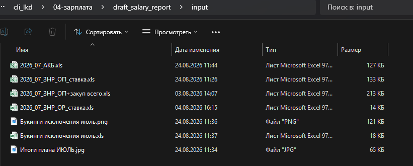
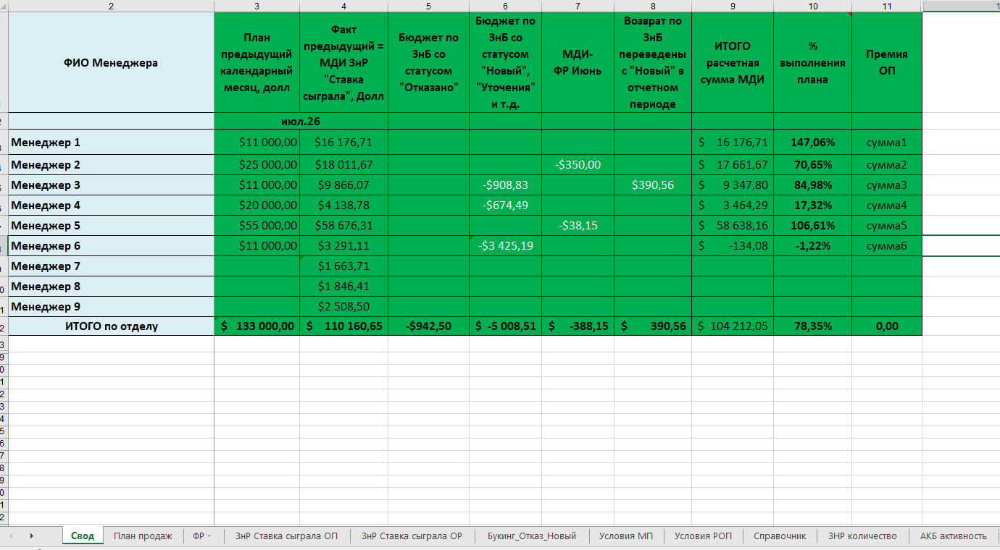

## Название

**salary_report** — ежемесячный расчёт зарплаты отдела продаж по выгрузкам из 1С.

## Проблема

Зарплатный отчёт по отделу продаж собирается вручную каждый месяц до 20-го числа. Источник — несколько XLS-выгрузок из 1С УПП, каждая по своему разрезу. Данные сводятся в Excel «руками»: копипаст из файлов, формулы, проверки. Это:

- **долго** — сборка занимает дни, а в окне до 20-го числа и без того тесно
- **ошибочно** — ручной перенос цифр между файлами = риск пересортицы и арифметических ошибок
- **непрозрачно** — менеджерам и РОПу не видно, из чего сложилась итоговая сумма
- **зависит от человека** — регламент расчета есть, но есть риск умышленных ручных корректировок

В `CLAUDE.md` зарплатный отчёт заявлен как ежемесячная задача с дедлайном до 20-го числа и прямой зависимостью от выгрузок из 1С — то есть идеально под автоматизацию.

## Пользователь

| Сегмент | Роль | Что получает |
|---|---|---|
| **РПУ** | Заказчик и исполнитель | Готовый XLSX со сводом, минимум ручной работы, проверяемые формулы |
| **Менеджеры** (9 чел.) | Получатели | Понимание, из чего сложилась сумма, без сюрпризов в день выплаты |
| **Бухгалтерия** | Получатель итогов | XLSX в формате, пригодном для переноса в 1С ЗУП |

## Основная функция

Сервис принимает несколько XLS-выгрузок из 1С за отчётный месяц и собирает из них единый XLSX-отчёт по зарплате отдела продаж.

**Вход:** 2+ XLS-файлов из `\input` за отчётный месяц. 
- данные по плану продаж
- данные по АКБ менеджеров
- проданные сделки отдела продаж
- проданные сделки отдела развития
- созданные сделки за отчетный период
- реестр отказных букингов (отменённые сделки) — ухудшают премию
  

**Выход:** XLSX-файл с листами:
- **Свод** — итог по каждому менеджеру: оклад + премия за план, с учётом влияния отказных букингов и итогов ФР
- Служебные листы с сырыми данными (для аудита)
  

**Инструменты:** Python-скрипт, который читает XLS через `pandas`/`openpyxl`, считает по формулам, пишет итоговый XLSX. Запуск — через скилл `salary_report` в Claude Code или напрямую через `python`.

## Формат результата

Пользователь получает **один XLSX-файл** в `04-зарплата/`, **полностью заполненный согласно эталону** из `03-отчёты/` и собранный автоматически.

**Структура листов выходного документа:**

| # | Лист | Назначение |
|---|---|---|
| 1 | **Свод** | Итог по каждому менеджеру: оклад + премия за план, с учётом корректировок (отказные букинги, ФР), итого к начислению |
| 2 | **Итоги плана продаж** | Помесячный план-факт по менеджерам: % выполнения, выполнен/не выполнен, база для начисления премии |
| 3 | **Итоги ФР** | Итоги упущенной выгоды по вине менеджера(отрицательный финансовый результат) |
| 4 | **ЗНР ОП** | Реестр проданных сделок (заявок на расчёт) по менеджерам отдела продаж  |
| 5 | **ЗНР ОР** | Реестр проданных сделок (заявок на расчёт) по отделу развития |
| 6 | **Букинг отказ/новый** | Реестр отказных и не переданных в работу букингов |
| 7 | **Условия МП** | Регламент расчета |
| 8 | **Условия РОП** | Регламент расчета |
| 9 | **Справочник** | Клиенты посредники |
| 10 | **ЗНР Количество** | Общее количество созданных сделок (для аудита конверсии ЗНР) |
| 11 | **АКБ активность** | АКБ менеджеров (для аудита активности клиента и работы с закрепленной базой) |
| 12 | **Лог** | Что делал скрипт, какие файлы читал, какие формулы применил (контрольная точка) |

Файл пригоден для печати, пересылки РОПу, передачи в бухгалтерию.

## Эталон документа

Источник истины для структуры выходного XLSX — **эталоны в `\etalons`**. Имена колонок, порядок листов, формулы, оформление — всё должно соответствовать эталону.

## Минимальный функционал (MVP)

**В MVP входит:**
- ✅ Чтение 2+ XLS-выгрузок из 1С за месяц из `\input`
- ✅ Автоматическая сборка XLSX **по эталону** из `\etalons` (когда появится)
- ✅ Лист **«Свод»** — оклад + премия за выполнение плана продаж
- ✅ Лист **«ЗНР ОП»** — реестр ЗНР по менеджерам отдела продаж
- ✅ Лист **«ЗНР ОР»** — реестр ЗНР по отделу развития
- ✅ Лист **«Итоги плана продаж»** — план-факт по менеджерам
- ✅ Учёт влияния **отказных букингов** (снижают/обнуляют премию)
- ✅ Учёт итогов **ФР** (финансовый результат) — корректировка по закрытию месяца
- ✅ Лист «Лог» с контрольными цифрами
- ✅ XLSX пригоден для пересылки РОПу и в бухгалтерию

**В будущем добавим (не в MVP):**
- 🔜 Бонус от объёма сборного груза (только Модель 3)
- 🔜 Бонус по МДИ (минимально допустимый интерес) — по расходному ордеру после ФР
- 🔜 Сравнение «месяц к месяцу» (динамика)
- 🔜 Аномалии и предупреждения (если менеджер резко просел/вырос)
- 🔜 Шаблон PDF для рассылки менеджерам
- 🔜 Автоматический запуск по расписанию (cron)

## Технологии

| Слой | Инструмент | Зачем |
|---|---|---|
| Язык | **Python 3.11+** | Основной язык скрипта |
| Чтение/запись XLSX | **pandas** + **openpyxl** | Чтение выгрузок 1С, запись итогового файла |
| Запуск | **Скилл `salary_report`** в Claude Code | Триггер: данные появились в `\input` → запусти скилл |
| Хранение | Git (репо `cli_lkd`) | История версий скрипта и шаблонов |
| Конфигурация | `04-зарплата/config.yaml` | Список менеджеров, ставки, пороги по плану — без хардкода в коде |

**Формат ответа:** XLSX. Внутри — формулы Excel (не «зашитые» значения), чтобы бухгалтерия могла проверить руками.

## Связь 

| Папка | Что лежит |
|---|---|
| `04-зарплата/` | Скрипт `salary_report.py`, конфиг `config.yaml`, шаблоны XLSX, описание (этот файл) |
| `\input` | Входящие XLS-выгрузки из 1С за месяц |
| `\etalons` | Эталоны шаблонов отчётов (для сверки структуры) |
| `09-заметки/` | Заметки по ходу расчёта, отклонения, разъяснения |
 

## Скоуп проекта «Упрощение 1С»

`salary_report` — это **первый работающий проект** в `13-проект-упрощение-1С/` (формально он в `04-зарплата/`, потому что относится к зарплате, но по духу — упрощение работы с самописной 1С). После пилота формат выгрузки можно зафиксировать как «эталон 1С для зарплаты» и предъявить программистам как требование к стабильности реестра.
