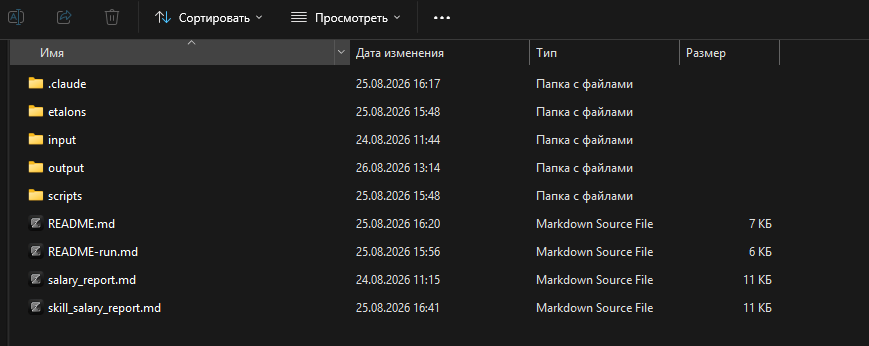

# salary_report — автоматический расчёт зарплаты отдела продаж

## Проблема

Расчёт зарплаты отдела продаж — ежемесячная рутинная задача РПУ (руководителя по процессному управлению). Каждый месяц нужно:

1. Выгрузить из 1С УПП несколько отчётов по ЗНР (заявкам на расчёт) и букингам.
2. Собрать их в один Excel по фиксированному шаблону (12 листов, формулы, ручные правки).
3. Рассчитать премии ОП и ОР по 7-ступенчатой шкале.
4. Проверить конверсию по рабочей базе клиентов.
5. Свести итоги по отделу.

Ручная сборка занимала 4-6 часов и была источником ошибок (ручная перетасовка менеджеров, сбитые формулы, устаревшие срезы АКБ). Проект автоматизирует 90% работы — остаётся только открыть результат в Excel и сверить цифры.

## Пользователь

**Прямой пользователь:** РПУ (руководитель отдела процессного управления).

**Кому ещё полезен:**
- **РОП** (руководитель по продажам) — получает готовые цифры для анализа эффективности менеджеров.
- **Методисты отдела** — фиксированная структура отчёта упрощает обновление регламентов.
- **Бухгалтерия/HR** — итоговый лист «Свод» содержит готовые суммы к выплате.

## Основная функция

Сервис принимает несколько XLS-выгрузок из 1С за отчётный месяц и собирает из них единый XLSX-отчёт по зарплате отдела продаж

**Вход:** 5 файлов из 1С УПП за отчётный месяц + JPG-план продаж + PNG-букинги исключения.
 

**Выход:** Excel-файл `salary_YYYY_MM.xlsx` (12 листов), полностью соответствующий эталону:
- **Свод** — итог по каждому менеджеру: оклад + премия за план, с учётом влияния отказных букингов и итогов ФР
- Служебные листы с сырыми данными (для аудита)
  

  **Листы отчёта:**

| Лист | Назначение | Источник |
|---|---|---|
| Свод | Премии ОП/ОР, итоги по отделу | формулы (5 ступеней) |
| ЗнР Ставка сыграла ОП | ЗНР со ставкой (ОП), 6 групп | ЗНР_ОП_ставка.xls |
| ЗнР Ставка сыграла ОР | ЗНР со ставкой (ОР) | ЗНР_ОР_ставка.xls |
| План продаж | Скриншот плана | Итоги плана.jpg |
| Букинг_Отказ_Новый | Отказные/уточнения | Букинги исключения.xls |
| ФР - | История корректировок МДИ | ручной ввод |
| АКБ активность | Клиенты «Рабочий» + VLOOKUP | АКБ.xls |
| ЗНР количество | Счёт ЗНР по менеджерам | ЗНР_ОП+закуп всего.xls |
| Условия МП | Шкала премии ОП | эталон |
| Условия РОП | Шкала премии ОР | эталон |
| Справочник | Посредники и пр. | эталон |

**Задействованные инструменты:**
- **Python 3.14** — основной язык
- **openpyxl** — создание/чтение .xlsx, формулы, стили
- **xlrd 2.0.1** — чтение старых .xls из 1С
- **Pillow** — встраивание JPG/PNG в Excel
- **PowerShell 5.1** — запуск скрипта

**Skill для Claude Code:** `.claude/skills/salary-report/SKILL.md` — локальный skill проекта (структура, справочники, типичные задачи, диагностика). Загружается автоматически при работе из этой папки.

 

## Формат результата

Пользователь получает **один XLSX-файл** в `04-зарплата/`, **полностью заполненный согласно эталону** из `03-отчёты/` и собранный автоматически.

**Структура листов выходного документа:**

| # | Лист | Назначение |
|---|---|---|
| 1 | **Свод** | Итог по каждому менеджеру: оклад + премия за план, с учётом корректировок (отказные букинги, ФР), итого к начислению |
| 2 | **Итоги плана продаж** | Помесячный план-факт по менеджерам: % выполнения, выполнен/не выполнен, база для начисления премии |
| 3 | **Итоги ФР** | Итоги упущенной выгоды по вине менеджера(отрицательный финансовый результат) |
| 4 | **ЗНР ОП** | Реестр проданных сделок (заявок на расчёт) по менеджерам отдела продаж  |
| 5 | **ЗНР ОР** | Реестр проданных сделок (заявок на расчёт) по отделу развития |
| 6 | **Букинг отказ/новый** | Реестр отказных и не переданных в работу букингов |
| 7 | **Условия МП** | Регламент расчета |
| 8 | **Условия РОП** | Регламент расчета |
| 9 | **Справочник** | Клиенты посредники |
| 10 | **ЗНР Количество** | Общее количество созданных сделок (для аудита конверсии ЗНР) |
| 11 | **АКБ активность** | АКБ менеджеров (для аудита активности клиента и работы с закрепленной базой) |
| 12 | **Лог** | Что делал скрипт, какие файлы читал, какие формулы применил (контрольная точка) |

Файл пригоден для печати, пересылки РОПу, передачи в бухгалтерию.

## Эталон документа

Источник истины для структуры выходного XLSX — **эталоны в `\etalons`**. Имена колонок, порядок листов, формулы, оформление — всё должно соответствовать эталону.

## Минимальный функционал (MVP)

**В MVP входит:**
- ✅ Чтение 2+ XLS-выгрузок из 1С за месяц из `\input`
- ✅ Автоматическая сборка XLSX **по эталону** из `\etalons` (когда появится)
- ✅ Лист **«Свод»** — оклад + премия за выполнение плана продаж
- ✅ Лист **«ЗНР ОП»** — реестр ЗНР по менеджерам отдела продаж
- ✅ Лист **«ЗНР ОР»** — реестр ЗНР по отделу развития
- ✅ Лист **«Итоги плана продаж»** — план-факт по менеджерам
- ✅ Учёт влияния **отказных букингов** (снижают/обнуляют премию)
- ✅ Учёт итогов **ФР** (финансовый результат) — корректировка по закрытию месяца
- ✅ Лист «Лог» с контрольными цифрами
- ✅ XLSX пригоден для пересылки РОПу и в бухгалтерию

**В будущем добавим (не в MVP):**
- 🔜 Бонус от объёма сборного груза (только Модель 3)
- 🔜 Бонус по МДИ (минимально допустимый интерес) — по расходному ордеру после ФР
- 🔜 Сравнение «месяц к месяцу» (динамика)
- 🔜 Аномалии и предупреждения (если менеджер резко просел/вырос)
- 🔜 Шаблон PDF для рассылки менеджерам
- 🔜 Автоматический запуск по расписанию (cron)

## Технологии

| Слой | Инструмент | Зачем |
|---|---|---|
| Язык | **Python 3.11+** | Основной язык скрипта |
| Чтение/запись XLSX | **pandas** + **openpyxl** | Чтение выгрузок 1С, запись итогового файла |
| Запуск | **Скилл `salary_report`** в Claude Code | Триггер: данные появились в `\input` → запусти скилл |
| Хранение | Git (репо `cli_lkd`) | История версий скрипта и шаблонов |
| Конфигурация | `04-зарплата/config.yaml` | Список менеджеров, ставки, пороги по плану — без хардкода в коде |

**Формат ответа:** XLSX. Внутри — формулы Excel (не «зашитые» значения), чтобы бухгалтерия могла проверить руками.

## Связь 

| Папка | Что лежит |
|---|---|
| `04-зарплата/` | Скрипт `salary_report.py`, конфиг `config.yaml`, шаблоны XLSX, описание (этот файл) |
| `\input` | Входящие XLS-выгрузки из 1С за месяц |
| `\etalons` | Эталоны шаблонов отчётов (для сверки структуры) |
| `09-заметки/` | Заметки по ходу расчёта, отклонения, разъяснения |

 

## Скоуп проекта «Упрощение 1С»

`salary_report` — это **первый работающий проект** в `13-проект-упрощение-1С/` (формально он в `04-зарплата/`, потому что относится к зарплате, но по духу — упрощение работы с самописной 1С). После пилота формат выгрузки можно зафиксировать как «эталон 1С для зарплаты» и предъявить программистам как требование к стабильности реестра.
